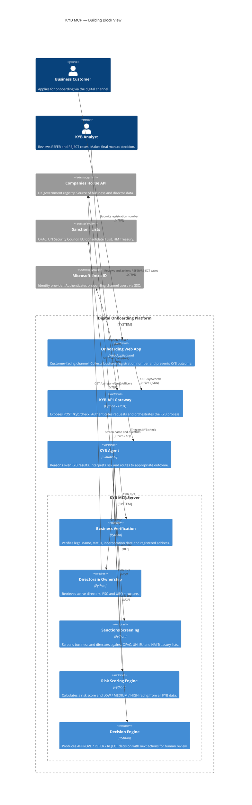

# KYB MCP — Architecture & Flow

## Building Block View



---

## Text Architecture

```
┌─────────────────────────────────────────────────────────────────┐
│                  DIGITAL ONBOARDING CHANNEL                     │
│            (Web App — Business Customer facing)                 │
└────────────────────────────┬────────────────────────────────────┘
                             │  ① Submits KYB request
                             │  (registration number, business name)
                             ▼
┌─────────────────────────────────────────────────────────────────┐
│                    KYB API GATEWAY                              │
│              (Flask REST API — POST /kyb/check)                 │
│         Accepts request, authenticates, triggers agent          │
└────────────────────────────┬────────────────────────────────────┘
                             │  ② Triggers KYB Agent
                             ▼
┌─────────────────────────────────────────────────────────────────┐
│                      KYB AGENT (Claude)                         │
│   Orchestrates the KYB flow, calls MCP tools in sequence,       │
│   interprets results and determines referral path               │
└────────────────────────────┬────────────────────────────────────┘
                             │  ③ Calls run_full_kyb tool
                             ▼
┌─────────────────────────────────────────────────────────────────┐
│                     KYB MCP SERVER                              │
│                                                                 │
│   ④ verify_business ──────► Companies House API (UK)            │
│          │                  Returns: name, status, address      │
│          ▼                                                      │
│   ⑤ get_directors ────────► Companies House API (UK)            │
│          │                  Returns: directors, PSC/UBO         │
│          ▼                                                      │
│   ⑥ screen_sanctions ─────► OFAC / UN / EU / HM Treasury       │
│          │                  Returns: hits, clear flag           │
│          ▼                                                      │
│   ⑦ calculate_risk_score   (Internal scoring engine)            │
│          │                  Returns: score, LOW/MEDIUM/HIGH     │
│          ▼                                                      │
│   ⑧ decision_engine        (Internal logic)                     │
│                             Returns: APPROVE / REFER / REJECT   │
└────────────────────────────┬────────────────────────────────────┘
                             │  ⑨ Returns KYB decision + details
                             ▼
┌─────────────────────────────────────────────────────────────────┐
│                      KYB AGENT (Claude)                         │
│      Receives structured decision, formats response             │
└──────────┬──────────────────────────────────────────┬──────────┘
           │                                          │
    ⑩ APPROVE                              ⑩ REFER or REJECT
           │                                          │
           ▼                                          ▼
┌──────────────────────┐              ┌───────────────────────────┐
│  ONBOARDING CHANNEL  │              │     HUMAN REVIEWER        │
│  Proceeds with       │              │  KYB Analyst reviews case │
│  onboarding journey  │              │  Takes manual decision    │
└──────────────────────┘              │  Approves / Rejects       │
                                      └───────────────────────────┘
```

---

## Step-by-Step Flow

| Step | Who | What Happens |
|------|-----|-------------|
| ① | Business Customer | Fills in registration number on Digital Onboarding Channel |
| ② | Onboarding Channel | Sends POST /kyb/check to KYB API Gateway |
| ③ | KYB API Gateway | Authenticates request, triggers KYB Agent |
| ④ | KYB Agent | Calls `run_full_kyb` on MCP Server |
| ⑤ | MCP Server | Calls Companies House — verifies business status and details |
| ⑥ | MCP Server | Calls Companies House — retrieves directors and PSC/UBO |
| ⑦ | MCP Server | Screens business and directors against sanctions lists |
| ⑧ | MCP Server | Calculates risk score from all gathered data |
| ⑨ | MCP Server | Decision engine produces APPROVE / REFER / REJECT + next actions |
| ⑩ | KYB Agent | Returns structured decision back to API Gateway |
| ⑪ | API Gateway | Returns result to Onboarding Channel |
| ⑫a | Onboarding Channel | If APPROVE → continues onboarding journey |
| ⑫b | Onboarding Channel | If REFER/REJECT → notifies customer, routes case to KYB Analyst |
| ⑬ | Human Reviewer | Reviews REFER/REJECT cases, takes final decision |

---

## Decision Outcomes

| Decision | Risk Rating | Meaning | Next Step |
|----------|-------------|---------|-----------|
| **APPROVE** | LOW | Business passed all KYB checks | Proceed with onboarding |
| **REFER** | MEDIUM | Needs further review | Route to KYB Analyst |
| **REJECT** | HIGH / Sanctions hit | Business fails KYB requirements | Block onboarding, notify customer |
