# KYB MCP — Architecture & Flow

---

## Agentic Model — Building Block View

---

## Agentic ReAct Loop — How the Agent Thinks

```mermaid
flowchart TD
    A([KYB Request Received]) --> B

    B["🧠 REASON\nWhat do I know?\nWhat do I need next?"]
    B --> C["⚙️ ACT\nCall a KYB tool via MCP"]
    C --> D["👁️ OBSERVE\nRead the tool result"]
    D --> E{Enough to decide?}

    E -->|No — need more data| B
    E -->|Early exit condition met| F
    E -->|All checks complete| G

    F["⚠️ EARLY EXIT\nExamples:\n• Business dissolved → REJECT now\n• Sanctions hit found → REJECT now\n• Critical data missing → REFER now"]

    G["✅ FINAL DECISION\nCall decision engine\nAPPROVE / REFER / REJECT"]

    F --> H
    G --> H

    H{Requires human review?}
    H -->|APPROVE| I([Onboarding proceeds])
    H -->|REFER| J([Route to KYB Analyst])
    H -->|REJECT| K([Application declined])

    style B fill:#ede9fe,stroke:#7c3aed
    style C fill:#dcfce7,stroke:#16a34a
    style D fill:#dbeafe,stroke:#3b82f6
    style F fill:#fee2e2,stroke:#dc2626
    style G fill:#bbf7d0,stroke:#16a34a
    style I fill:#bbf7d0,stroke:#16a34a
    style J fill:#ffedd5,stroke:#ea580c
    style K fill:#fee2e2,stroke:#dc2626
```

---

## Pipeline vs Agentic — Key Difference

| | Pipeline Model (Before) | Agentic Model (Now) |
|--|--------------------------|----------------------|
| **Tool execution** | Fixed sequence, always all tools | Agent decides what to call and when |
| **Early exit** | No — always runs all steps | Yes — stops as soon as decision is clear |
| **Reasoning** | None — deterministic | Yes — reasons after every tool result |
| **Flexibility** | Rigid | Adapts based on intermediate results |
| **Example** | Dissolved company still runs sanctions check | Dissolved company → REJECT immediately, no further checks |

---

## Decision Outcomes

| Decision | Risk Rating | Meaning | Next Step |
|----------|-------------|---------|-----------|
| **APPROVE** | LOW | Business passed all KYB checks | Proceed with onboarding |
| **REFER** | MEDIUM | Needs further review | Route to KYB Analyst |
| **REJECT** | HIGH / Sanctions hit | Business fails KYB requirements | Block onboarding, notify customer |
