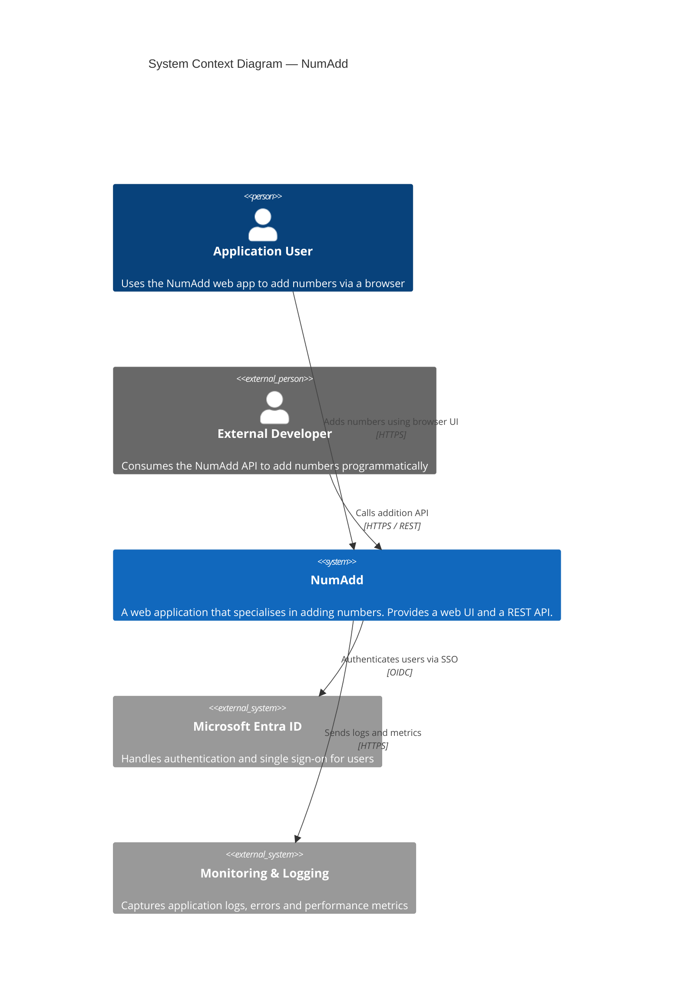

# NumAdd — C4 Level 1: System Context Diagram

```mermaid
C4Context
    title System Context Diagram — NumAdd

    Person(appUser, "Application User", "Uses the NumAdd web app to add numbers via a browser")
    Person_Ext(developer, "External Developer", "Consumes the NumAdd API to add numbers programmatically")

    System(numAdd, "NumAdd", "A web application that specialises in adding numbers. Provides a web UI and a REST API.")

    System_Ext(entraId, "Microsoft Entra ID", "Handles authentication and single sign-on for users")
    System_Ext(monitoring, "Monitoring & Logging", "Captures application logs, errors and performance metrics")

    Rel(appUser, numAdd, "Adds numbers using browser UI", "HTTPS")
    Rel(developer, numAdd, "Calls addition API", "HTTPS / REST")
    Rel(numAdd, entraId, "Authenticates users via SSO", "OIDC")
    Rel(numAdd, monitoring, "Sends logs and metrics", "HTTPS")
```
