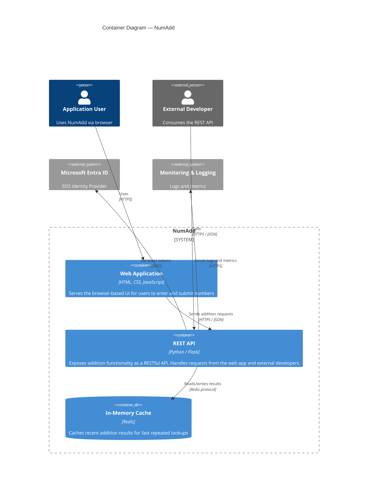

# NumAdd — C4 Level 2: Container Diagram

```mermaid
C4Container
    title Container Diagram — NumAdd

    Person(appUser, "Application User", "Uses NumAdd via browser")
    Person_Ext(developer, "External Developer", "Consumes the REST API")

    System_Ext(entraId, "Microsoft Entra ID", "SSO Identity Provider")
    System_Ext(monitoring, "Monitoring & Logging", "Logs and metrics")

    System_Boundary(numAdd, "NumAdd") {
        Container(webApp, "Web Application", "HTML, CSS, JavaScript", "Serves the browser-based UI for users to enter and submit numbers")
        Container(apiApp, "REST API", "Python / Flask", "Exposes addition functionality as a RESTful API. Handles requests from the web app and external developers")
        ContainerDb(cache, "In-Memory Cache", "Redis", "Caches recent addition results for fast repeated lookups")
    }

    Rel(appUser, webApp, "Uses", "HTTPS")
    Rel(developer, apiApp, "Calls", "HTTPS / JSON")
    Rel(webApp, apiApp, "Sends addition requests", "HTTPS / JSON")
    Rel(apiApp, entraId, "Validates tokens", "OIDC")
    Rel(apiApp, cache, "Reads/writes results", "Redis protocol")
    Rel(apiApp, monitoring, "Sends logs and metrics", "HTTPS")
```
