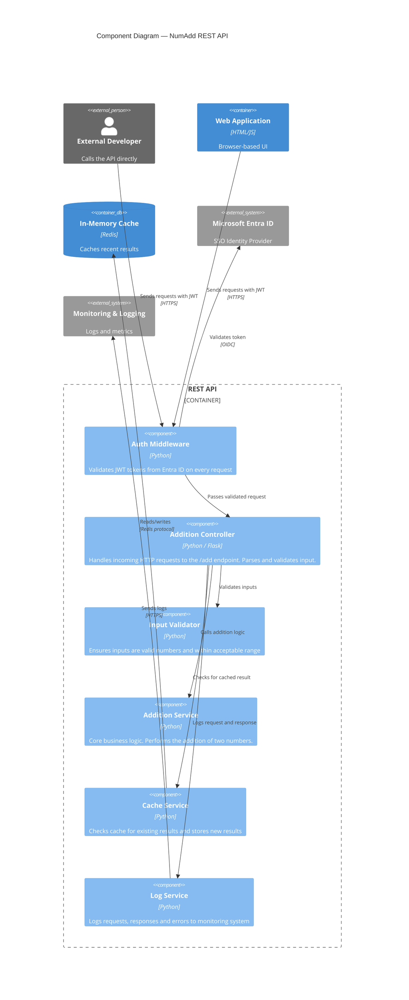

# NumAdd — C4 Level 3: Component Diagram (REST API)

```mermaid
C4Component
    title Component Diagram — NumAdd REST API

    Person_Ext(developer, "External Developer", "Calls the API directly")
    Container(webApp, "Web Application", "HTML/JS", "Browser-based UI")
    ContainerDb(cache, "In-Memory Cache", "Redis", "Caches recent results")
    System_Ext(entraId, "Microsoft Entra ID", "SSO Identity Provider")
    System_Ext(monitoring, "Monitoring & Logging", "Logs and metrics")

    Container_Boundary(apiApp, "REST API") {
        Component(authMiddleware, "Auth Middleware", "Python", "Validates JWT tokens from Entra ID on every request")
        Component(additionController, "Addition Controller", "Python / Flask", "Handles incoming HTTP requests to the /add endpoint. Parses and validates input.")
        Component(inputValidator, "Input Validator", "Python", "Ensures inputs are valid numbers and within acceptable range")
        Component(additionService, "Addition Service", "Python", "Core business logic. Performs the addition of two numbers.")
        Component(cacheService, "Cache Service", "Python", "Checks cache for existing results and stores new results")
        Component(logService, "Log Service", "Python", "Logs requests, responses and errors to monitoring system")
    }

    Rel(webApp, authMiddleware, "Sends requests with JWT", "HTTPS")
    Rel(developer, authMiddleware, "Sends requests with JWT", "HTTPS")
    Rel(authMiddleware, additionController, "Passes validated request")
    Rel(additionController, inputValidator, "Validates inputs")
    Rel(additionController, cacheService, "Checks for cached result")
    Rel(additionController, additionService, "Calls addition logic")
    Rel(additionController, logService, "Logs request and response")
    Rel(cacheService, cache, "Reads/writes", "Redis protocol")
    Rel(logService, monitoring, "Sends logs", "HTTPS")
    Rel(authMiddleware, entraId, "Validates token", "OIDC")
```
