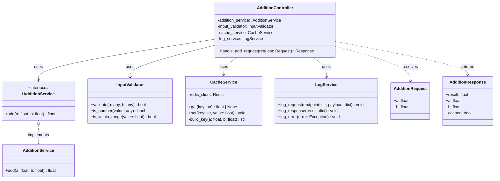

# NumAdd — C4 Level 4: Code Diagram (Addition Service)

```mermaid
classDiagram
    class IAdditionService {
        <<interface>>
        +add(a: float, b: float) float
    }

    class AdditionService {
        +add(a: float, b: float) float
    }

    class InputValidator {
        +validate(a: any, b: any) bool
        +is_number(value: any) bool
        +is_within_range(value: float) bool
    }

    class CacheService {
        -redis_client: Redis
        +get(key: str) float | None
        +set(key: str, value: float) void
        -build_key(a: float, b: float) str
    }

    class AdditionController {
        -addition_service: IAdditionService
        -input_validator: InputValidator
        -cache_service: CacheService
        -log_service: LogService
        +handle_add_request(request: Request) Response
    }

    class LogService {
        +log_request(endpoint: str, payload: dict) void
        +log_response(result: dict) void
        +log_error(error: Exception) void
    }

    class AdditionRequest {
        +a: float
        +b: float
    }

    class AdditionResponse {
        +result: float
        +a: float
        +b: float
        +cached: bool
    }

    IAdditionService <|.. AdditionService : implements
    AdditionController --> IAdditionService : uses
    AdditionController --> InputValidator : uses
    AdditionController --> CacheService : uses
    AdditionController --> LogService : uses
    AdditionController ..> AdditionRequest : receives
    AdditionController ..> AdditionResponse : returns
```
