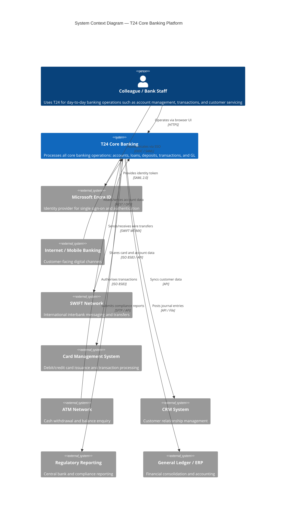

# T24 Core Banking Platform — C4 System Context Diagram

```mermaid
C4Context
    title System Context Diagram — T24 Core Banking Platform

    Person(colleague, "Colleague / Bank Staff", "Uses T24 for day-to-day banking operations such as account management, transactions, and customer servicing")

    System(t24, "T24 Core Banking", "Processes all core banking operations: accounts, loans, deposits, transactions, and GL")

    System_Ext(entraId, "Microsoft Entra ID", "Identity provider for single sign-on and authentication")
    System_Ext(internetBanking, "Internet / Mobile Banking", "Customer-facing digital channels")
    System_Ext(swift, "SWIFT Network", "International interbank messaging and transfers")
    System_Ext(cardSystem, "Card Management System", "Debit/credit card issuance and transaction processing")
    System_Ext(atm, "ATM Network", "Cash withdrawal and balance enquiry")
    System_Ext(crm, "CRM System", "Customer relationship management")
    System_Ext(regulatory, "Regulatory Reporting", "Central bank and compliance reporting")
    System_Ext(gl, "General Ledger / ERP", "Financial consolidation and accounting")

    Rel(colleague, entraId, "Authenticates via SSO", "OIDC / SAML")
    Rel(entraId, t24, "Provides identity token", "SAML 2.0")
    Rel(colleague, t24, "Operates via browser UI", "HTTPS")

    Rel(internetBanking, t24, "Reads/writes account data", "REST / OFS")
    Rel(t24, swift, "Sends/receives wire transfers", "SWIFT MT/MX")
    Rel(t24, cardSystem, "Shares card and account data", "ISO 8583 / API")
    Rel(atm, t24, "Authorises transactions", "ISO 8583")
    Rel(t24, crm, "Syncs customer data", "API")
    Rel(t24, regulatory, "Submits compliance reports", "SFTP / API")
    Rel(t24, gl, "Posts journal entries", "API / File")
```
